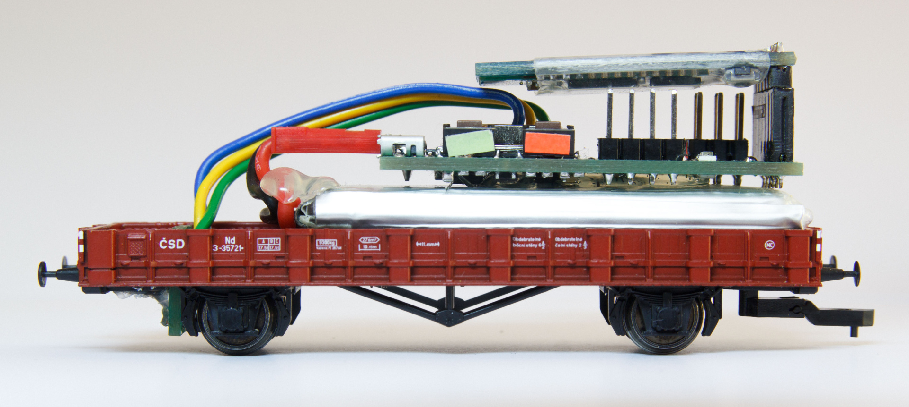

# WSM-PCB: A Wireless SpeedoMeter PCB

WSM is a model railroad car which measures speed of a train and transmits it via
Bluetooth. This repository contains schematics & PCBs layout for all the PCBs
used in the car.

The whole car is designed to be supplied by any 3.7V LiPo battery. PCB design
allows you to charge the battery via USB, so no disconnecting of the battery
nor external changer is required. The measurement is based on an opto-sensor
capturing a perforated wheel connected to an axis of a wheel of the car. The
speed-data are transmitted via HC-05 bluetooth module to any device supporting
SPP bluetooth profile.

This solution consists of a main board (`main-board.{brd,sch}`) and board
for connecting the optosensor (`opto-con.{brd,sch}`). Main board contains all
the logic, optosensor connector board contains no logic, it serves only for
mechanical purposes. Optosensor connector board is not required.

## Features

 * Speed-measuring based on opto-sensor.
 * Size 50×18 mm.
 * Transmits data via bluetooth.
 * No external power supply is required (no current from tracks).
 * Runs on battery, can measure up to 8 hours based on chosen battery.
 * Integrated charging circuit.
 * Charging from micro-USB connector.
 * ON/OFF switch.
 * Measuring of a battery level & undervoltage protection.

## Resources

 * [Firmware to the main CPU](https://github.com/kmzbrnoI/wsm-fw).
 * [Software to PC](https://github.com/kmzbrnoI/wsm-speed-reader).

## Toolkit

This PCB was designed in Eagle 9.

## Sensor

This boards was tested with
[GP1S23 opto sensor](http://static6.arrow.com/aropdfconversion/33ee6367e3f24c1538ff4b63e7c9272b758d9d51/tec_datasheet_gp1s23.pdf).
This sensor in commonly available at KY-010 Arduino module.

## Mechanics

## `place.tex`

This TeX file allows you to merge top and bottom place layouts into a single
document.

## Authors

 * Jan Horacek ([jan.horacek@kmz-brno.cz](mailto:jan.horacek@kmz-brno.cz))

## Credits

 * This project is inspired by the measure car designed by *Petr Travnik*.
 * The ON-OFF switch part is inspired by the RB3201 project of *[RoboticsBrno
   ](https://github.com/RoboticsBrno)*.
 * Many thanks to *Michal Petrilak* for help with development of this project.

## License

This project is released under the [Creative Commons Attribution-ShareAlike 4.0
](https://creativecommons.org/licenses/by-sa/4.0) license.
